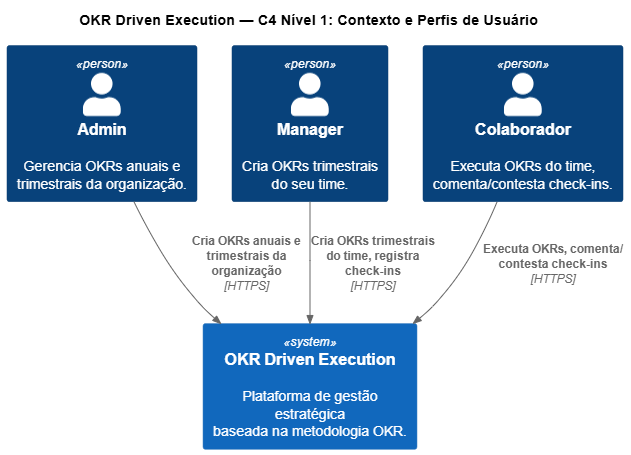
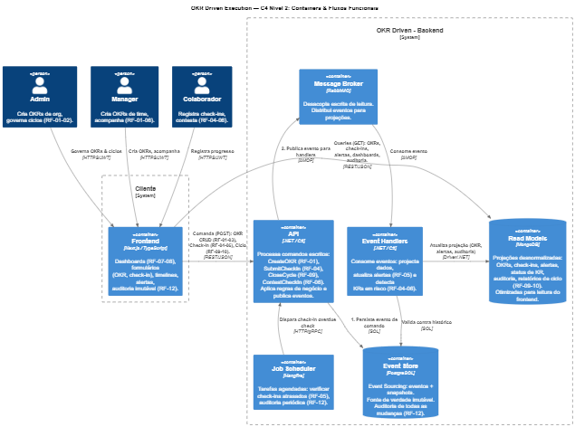

# OKR Driven

## 1. O Problema

Organizações modernas adotam OKRs como modelo de gestão estratégica, mas falham na execução. Definem objetivos vagos, não acompanham o progresso com disciplina, não dão visibilidade clara sobre o andamento das metas e não deixam explícito quem é responsável por cada entrega. Ao final do ciclo, quase não há análise para entender erros e acertos. O resultado é previsível: a metodologia vira discurso e o planejamento estratégico perde força.

## 2. A Solução: OKR Driven

OKR Driven é uma plataforma de gestão estratégica orientada por ciclos **trimestrais**, com governança clara e execução contínua. Em vez de tratar OKR como um documento estático, a solução transforma cada objetivo em um fluxo operacional com dono, progresso, status e histórico auditável.

O encadeamento é direto e sem ambiguidade:

**OKRs Anuais** (Admin define) → **OKRs Trimestrais da Organização** (Admin define e distribui metas por time) → **OKRs Trimestrais do Time** (Manager detalha a execução) → **Key Results do Time** (Colaborador executa e atualiza)

Na prática, o ciclo funciona em quatro momentos:
- Planejamento: definição dos OKRs anuais e desdobramento para o trimestre, com vínculo explícito entre meta organizacional e entrega de time.
- Execução: o time atualiza progresso por check-ins, registra contexto de avanço ou regressão e mantém visibilidade do status real.
- Acompanhamento: gestores e liderança acompanham dashboards com indicadores de saúde do ciclo (On-track, At-risk, Off-track) e priorizam intervenção.
- Encerramento: ao final do período, o resultado é consolidado com classificação objetiva e geração de insumos para aprendizado do próximo ciclo.

Além do acompanhamento de metas, a plataforma resolve problemas clássicos de operação de OKRs:
- Falta de clareza: cada KR nasce com responsável, período e critério de avaliação.
- Falta de contexto: toda atualização pode carregar comentário e justificativa, evitando leitura apenas numérica.
- Falta de responsabilidade: cada nível sabe exatamente para qual meta superior contribui.
- Falta de transparência: evolução e risco ficam visíveis para liderança, gestão e execução.
- Falta de memória organizacional: a trilha de auditoria preserva decisões, mudanças e resultados sem perda de histórico.

Com isso, a OKR Driven posiciona o OKR como rotina de gestão, não como cerimônia. O foco deixa de ser somente "definir metas" e passa a ser "entregar resultado com previsibilidade", conectando estratégia, execução e aprendizado contínuo no mesmo ambiente.

## 3. REQUISITOS FUNCIONAIS (RF)

### 3.1 Gestão de OKRs
- RF-01: Criar OKRs Anuais e OKRs Trimestrais da Organização (Admin); OKRs Trimestrais do Time (Manager do time)
- RF-02: Editar OKRs em fase Planning (bloqueado após ciclo trimestral ativo)
- RF-03: Listar OKRs com hierarquia (anuais, trimestrais org, trimestrais time; filtro por período e responsável)

### 3.2 Rastreamento de Progresso
- RF-04: Check-ins trimestrais: Manager registra % de progresso, Colaborador comenta/contesta (mandatory se regressou)
- RF-05: Timeline visual com 3 status (On-track / At-risk / Off-track)

### 3.3 Dashboard e Transparência
- RF-07: Dashboard executivo (3 cards: On-track, At-risk, Off-track; filtro por período trimestral ativo)
- RF-08: Vista por Responsável (meus OKRs do time + contexto qual KR org contribuo; status visual; link para comentar)

### 3.4 Ciclo Encerrado
- RF-09: Finalizar OKR ciclo (Admin registra % final; status automático: ≥80% Achieved, ≥50% Partial, <50% Failed)

### 3.5 Segurança e Controle
- RF-11: Controle de acesso (Admin gerencia org; Manager gerencia time; Colaborador executa)
- RF-12: Auditoria imutável (criação, edição, check-in, contestação, encerramento)

## 4. REQUISITOS NÃO-FUNCIONAIS (RNF)

- RNF-01: Performance - Dashboard carrega < 3s, Check-in salva < 2s
- RNF-02: Usabilidade - Interface clara, fluxo check-in < 5 minutos
- RNF-03: Segurança - JWT, bcrypt, HTTPS
- RNF-04: Manutenibilidade - Código documentado, testes para handlers críticos
- RNF-05: Conformidade - Log de auditoria (criação, edição, check-in, encerramento ciclo)

## 5. TECNOLOGIAS E JUSTIFICATIVAS

### 5.1 Frontend: Next.js + TypeScript

Next.js oferece Server-Side Rendering (SSR) para performance otimizada do dashboard executivo (RNF-01: carrega < 3s), roteamento integrado, deploy facilitado em plataformas modernas. TypeScript garante tipagem estática em componentes críticos, reduzindo bugs em tempo de desenvolvimento.

### 5.2 Backend: C# / .NET 8 + ASP.NET Core

.NET/C# é a base da arquitetura backend. Oferece robustez, escalabilidade e um ecossistema rico para padrões enterprise como DDD (Domain-Driven Design), CQRS (Command Query Responsibility Segregation) e Event-Driven Architecture. A escolha de .NET 8 garante performance de alta classe e suporte a padrões modernos de arquitetura.

### 5.3 Arquitetura: DDD, CQRS, Event-Driven Architecture

- **Domain-Driven Design (DDD):** Estrutura o domínio de OKRs, Check-ins e Ciclos com linguagem ubíqua. Agregados garantem consistência das regras de negócio (ex: OKRs não podem ser editados após ciclo ativo — RF-02).
- **CQRS:** Separa caminho de escrita (comandos) do caminho de leitura (queries). Escrita persiste eventos no PostgreSQL; leitura consulta projeções otimizadas no MongoDB. Essa separação permite que o dashboard carregue rapidamente sem impacto de transações de escrita.
- **Event-Driven Architecture:** Alertas, relatórios e auditoria são processados assincronamente via RabbitMQ. Não bloqueiam o check-in do usuário (RNF-01: check-in < 2s).

### 5.4 Banco de Dados: PostgreSQL (Escrita) + MongoDB (Leitura)

**PostgreSQL — Event Store:**
PostgreSQL é o banco de escrita canônico. Armazena eventos imutáveis e snapshots usando Event Sourcing. Garantia ACID garante integridade total das mudanças. Cada evento registrado é a fonte definitiva para auditoria (RF-12), sem necessidade de soft-deletes.

**MongoDB — Projeções e Read Models:**
MongoDB armazena projeções desnormalizadas otimizadas para consultas rápidas: OKRs, Check-ins, Alertas, Status de KRs, Relatórios. Event Handlers consomem eventos do PostgreSQL e atualizam projeções no MongoDB assincronamente (padrão CQRS). Resultado: queries rápidas para o dashboard (RNF-01).

### 5.5 Infraestrutura: Docker + Terraform

**Docker:** Containeriza toda a stack (API .NET, Next.js, PostgreSQL, MongoDB, RabbitMQ) para ambiente homogêneo. Facilita desenvolvimento local e deploy idêntico em qualquer environment.

**Terraform:** Define infraestrutura como código, permitindo deploy reproduzível em qualquer cloud (AWS, Azure, GCP). Versionado junto ao código, facilita rollback e auditoria de mudanças.

### 5.6 Qualidade e Monitoramento: Serilog, SonarQube

**Serilog:** Logging estruturado e centralizado. Essencial para auditoria (RF-12) e debugging em produção.

**SonarQube:** Análise estática contínua de qualidade de código, identificação de code smells, bugs e vulnerabilidades de segurança.

**New Relic:** Monitoramento de performance e observabilidade em tempo real. Rastreamento de transações, erros e saúde geral da aplicação.

## 6. Diagramas de Arquitetura - Modelo C4

<strong>Nível 1: Contexto do Sistema</strong>

Visão de alto nível dos atores e sistemas externos que interagem com OKR Driven.

	

<strong>Nível 2: Containers (Componentes Principais)</strong>

Decomposição da solução em containers: Frontend (Next.js), Backend (ASP.NET Core), Bancos de Dados (PostgreSQL, MongoDB), Message Queue (RabbitMQ) e serviços auxiliares.

	

